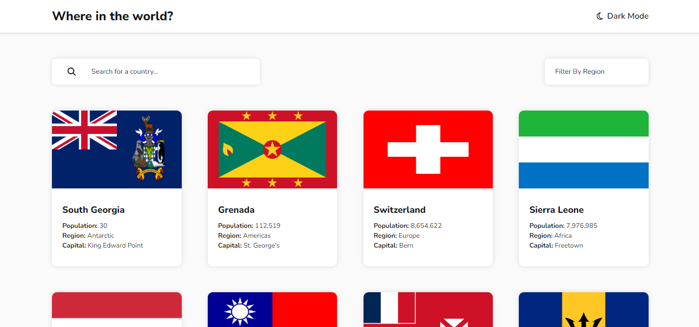

# Frontend Mentor - REST Countries API with color theme switcher solution

This is a solution to the [REST Countries API with color theme switcher challenge on Frontend Mentor](https://www.frontendmentor.io/challenges/rest-countries-api-with-color-theme-switcher-5cacc469fec04111f7b848ca). Frontend Mentor challenges help you improve your coding skills by building realistic projects. 

## Table of contents

- [Overview](#overview)
  - [The challenge](#the-challenge)
  - [Screenshot](#screenshot)
  - [Links](#links)
- [My process](#my-process)
  - [Built with](#built-with)
  - [What I learned](#what-i-learned)
  - [Continued development](#continued-development)
- [Author](#author)

## Overview

### The challenge

Users should be able to:

- See all countries from the API on the homepage
- Search for a country using an `input` field
- Filter countries by region
- Click on a country to see more detailed information on a separate page
- Click through to the border countries on the detail page
- Toggle the color scheme between light and dark mode *(optional)*

### Screenshot

### Links

- Solution URL: [Solution](https://github.com/MohamDah/countries)
- Live Site URL: [Live Site](https://mohamdah-countries.netlify.app/)

## My process

### Built with

- Semantic HTML5 markup
- CSS custom properties
- Flexbox
- CSS Grid
- Mobile-first workflow
- [React](https://reactjs.org/) - JS library
- [React Router](https://reactrouter.com/) - JS library

### What I learned

I haven't made many projects using APIs until now, so it was pretty intimidating, but that's how you learn new things, isn't it? I learned more about using fetch and async functions, and other stuff like `Promise.all` and using React Router redirects. There are definetly a lot more things that I learn that I can't list here, but overall, this was a very educational project for me.

### Continued development

I would like to use APIs more in the future. I hope to get better at fullstack development and learning to use APIs effectively will be very useful.

## Author

- Website - [Mohamed Dahab](mohamdah.netlify.app)
- Frontend Mentor - [@MohamDah](https://www.frontendmentor.io/profile/MohamDah)
- Linkedin - [Mohamed Dahab](https://www.linkedin.com/in/mohamdah/)

